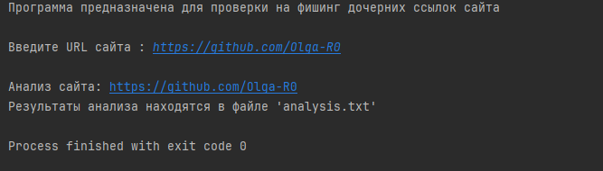

# URL_analysis_Python

Анализатор дочерних ссылок URL‑адреса: проверяет ссылки на признаки подозрительных/фишинговых сайтов.

## Навыки

## Описание

Проект предназначен для автоматического анализа дочерних ссылок, найденных на заданной веб‑странице. Программа извлекает все ссылки и проверяет их на соответствие ряду критериев (фишинг).

## Функциональность

Программа выполняет следующие шаги:
1. Получает HTML‑код целевой веб‑страницы.
2. Извлекает все дочерние ссылки (`<a href="...">`).
3. Для каждой ссылки проводит анализ по заданным критериям.
4. Выводит отчёт.

## Проверяемые признаки

### 1. Подозрительные ключевые слова

Проверяется наличие в домене или пути URL слов, часто встречающихся в фишинговых и мошеннических ссылках.

**Примеры подозрительных слов:**
* `login`, `secure`, `account`, `verify`, `update` (если не относятся к официальному домену);
* Список подозрительных слов может быть расширен
  
**Логика проверки:** если в домене/пути встречается хотя бы одно из ключевых слов из предопределённого списка — ссылка помечается как подозрительная.

### 2. Длина домена

Анализируется длина основной части домена.

**Критерий:**
* **Подозрительно:** длина домена превышает 60 символов.
* **Обоснование:** злоумышленники часто используют длинные, запутанные домены, чтобы скрыть истинное назначение сайта или имитировать легитимные адреса.

### 3. Дефисы в домене

Подсчитывается количество дефисов (`-`) в основной части домена.

**Критерий:**
* **Подозрительно:** в домене содержится 2 и более дефиса.

Улучшением проекта станет добавление еще ряда признаков для проверки.
  
## Пример работы

Как пример URL сайта был взят текущий профиль гитхаб. Такая проверка не корректна для такого типа сайта(много ключевых слов). URL был использован только в качестве примера. Результат находится в текстовом файле выше. 

## Улучшение проекта
Как улучшением для проекта станет анализ еще и содержимого страницы сайта, анализ форм и картинок (детекция стего-контейнеров). 
